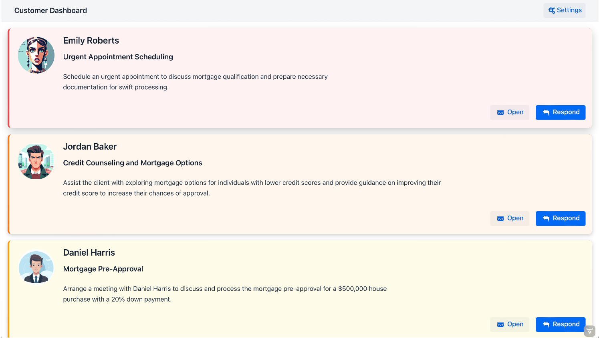
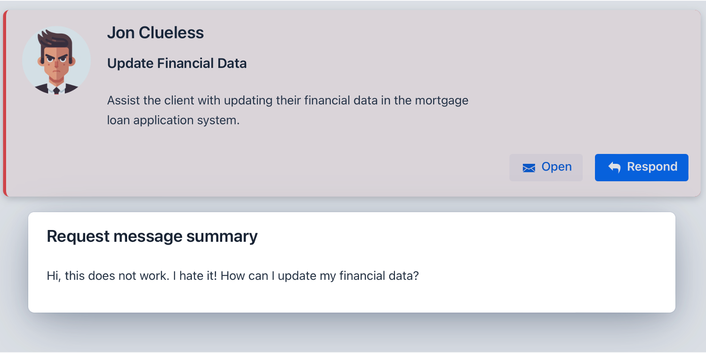
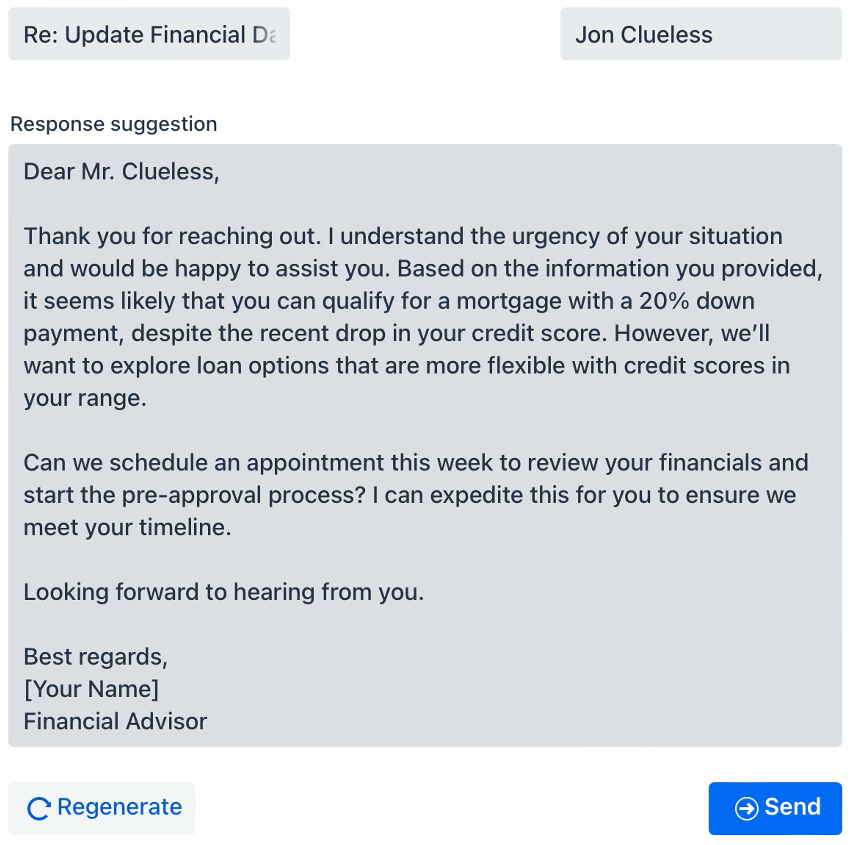
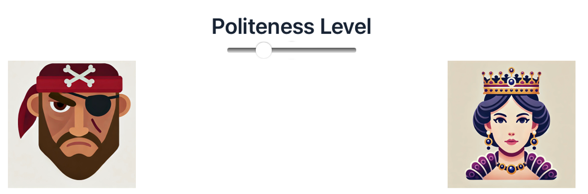
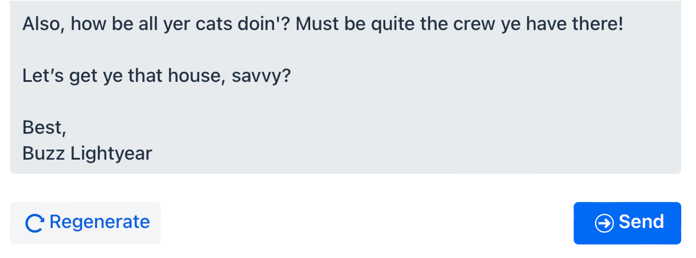
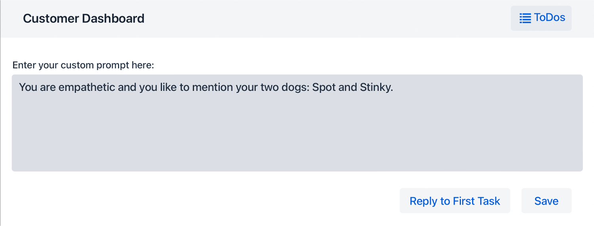
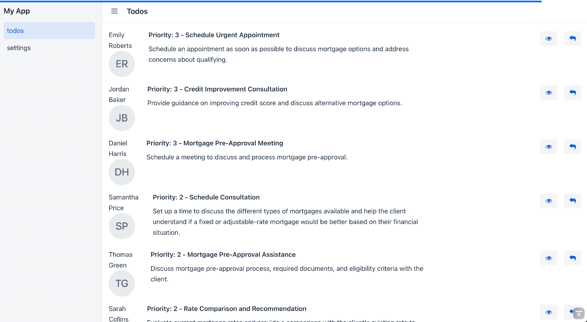
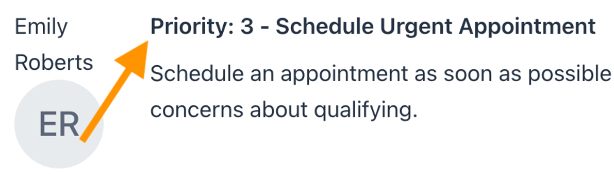
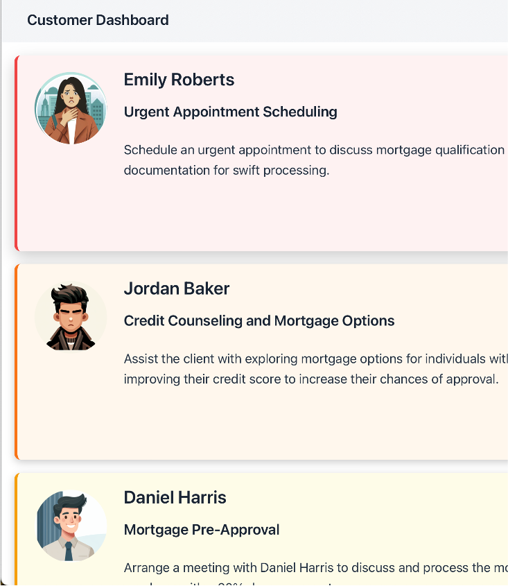
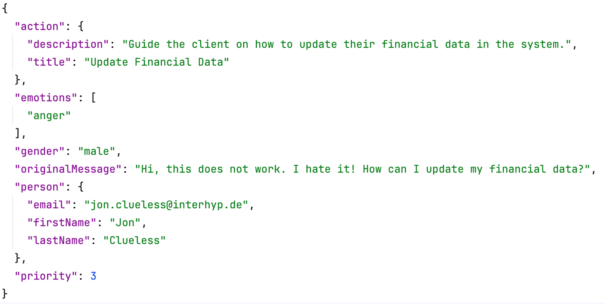

# Customer Dashboard using Emotional Scoring and Customer Prioritization
## Generative AI Hackathon 2024, Track "GenAI for employees", Team "AI Wasps"

Communication is important for the success of financial advisors. Advisors communicate with many different customers daily and each customer has different needs and to-dos. Some kind of prioritization is needed to help organize and structure the advisors' tasks. But prioritizing customers is often done manually today.

In the GenAI Hackathon 2024 our team explored how generative AI could be used to help financial advisors prioritize their customers and speed-up communication tasks like writing emails.

The basic idea is to provide a dashboard of customers. The dashboard contains a list of customers and a short description of the action required to be done by the advisor for that customer. These actions are prioritized automatically according to urgency and emotionality as expressed by the customer. This information is extracted from the advisors' inboxes which saves the advisors from having to scan their inboxes manually. The additional time can then be spent with the customers to ensure that their goals are reached.

### Technologies Used

We've used the [Hilla framework](https://hilla.dev) to build our frontend and backend faster. The frontend is using [React](https://react.dev) and the backend is using [Spring Boot](https://spring.io/projects/spring-boot). These two are established technologies brought together very nicely by Hilla. The AI is integrated using [Spring AI](https://spring.io/projects/spring-ai). And last but not least: We used [OpenAI](https://openai.com) as the generative AI and [DALL-E](https://openai.com/index/dall-e-3/) to generate images.

### How to Run

1) You need to configure Spring AI with a key for OpenAI. You can do this by setting an environment variable: `export SPRING_AI_OPENAI_API_KEY=<INSERT KEY HERE>`
2) Make sure that Apache Maven and an appropriate JDK (22 or newer) are installed.
2) Check out this project's code and run mvn inside the project's folder: `mvn`

The customer dashboard should open automatically in your browser when you run `mvn` inside the project directory (the dashboard's address is http://localhost:8080).

### The Customer Dashboard

The application will read a pre-defined set of mocked emails which we have asked the AI to generate for us. These emails will be analyzed by the AI to generate the to-dos for each email and each customer upon startup. The three most urgent actions are at the top of the list and include an image to the left of the required action. These images represent a customer's gender and emotional state as identified by the AI. The images and the text might vary with each run because they are generated "live" by the AI. The list of actions is ordered by urgency and emotional state. This is what the dashboard looks like:

   

You can click on `Open` to see the original message sent by the customer. The priority, the action title and the action's description as well as the customer's image are based on this message:

   

### Generate Email Responses

When you click on `Respond` then a form will open with a pre-generated text. You can edit this suggestion or hit `Regenerate` to generate a new suggestion. Click on `Send` in order to send this suggested and, optionally, edited text to the customer. This message will currently not be sent but instead a little animation is shown. In theory though this could be used to send an actual email to the customer.

   

#### Regeneration, Suggestions and Pirates

Clicking on `Regenerate` will ask the AI to generate a new response. This response does respect the "politeness level" which can be set right under the `Regenerate` button. You can move the slider to the left to ask the AI to generate a response in a way a pirate would talk. Move the slider to the right to ask it to regenerate the response like a queen would talk:

   
   

We implemented this feature to fool around with the AI. But it could be used to fine-tune the response generation in other ways too. It shows how adaptable and how personizable generative AI can be. 

#### Personalization

The application allows to provide a custom prompt which will be added to each request made to the AI when responses are generated. This allows financial advisors to tweak the generation by providing some personal details: They can provide personal details or a description of their personal style. You can set the custom prompt when clicking `Settings` in the upper right corner.

   

### The Story of Customer Images / Avatars

Why do we generate images representing the customers' emotional states for the most urgent customers? We didn't in the first iteration of our application:

   

We, of course, sorted the to-dos by their priorities but displayed the priorities directly:

   

Nothing really stand out in that draft. We changed that early during development to make it easier to _see_ the urgency (and therefore priority) easily at first glance. We humans evolved to identify and interpret faces quickly and easily. So this is the approach we decided to implement: Let the AI generate faces which represent a customer's gender and emotional state. The result is much more intuitive and faster to understand:

   

### Example: A Response from the AI

The application uses a [detailed prompt](src/main/resources/todo-prompt-user.st) which asks the AI to extract all relevant information from a provided email text and an email address. This information includes:

- The first and the last name of the customer from the email text (if the name is mentioned there) or the email address (it might include the name too) as well as the customer's gender
- The action which should be taken to meet the customer's needs consisting of a short title and a description
- The urgency / priority as a number between 1 and 3 depending on the customer's needs and emotional state
- The emotional state which must be one of anger, disgust, fear, happiness, sadness or surprise

The action and name are displayed in the dashboard. The priority is used to sort the dashboard and the gender and the emotional state are used to generate the customer's image / avatar. 

If the email address starts with "jon.clueless@" and the email text is the following:
> "Hi, this does not work. I hate it! How can I update my financial data?"

Then the AI's response might look like this:

   

### Team "AI Wasps"

- [Avataw](https://github.com/Avataw) (Andre)
- [kingrio22](https://github.com/kingrio22) (Max)
- [multigrid101](https://github.com/multigrid101) (Sebastian)
- [schwwwan](https://github.com/schwwwan) (Tobias)
- [spartusch](https://github.com/spartusch) (Stefan)
